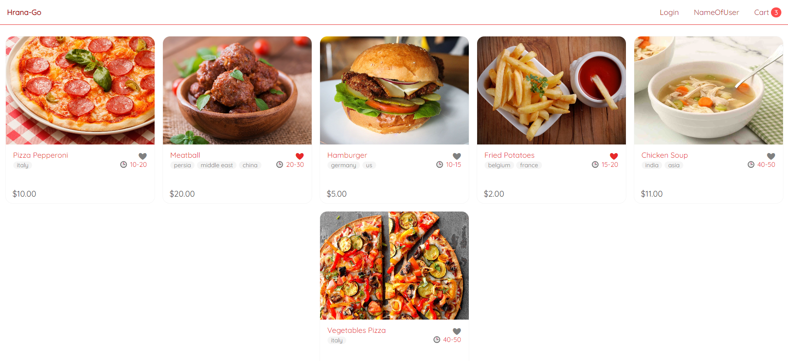

# Spletna Trgovina

# Status projekta
Se izvaja (izboljšuje)

## Opis
**Spletna Trgovina** je spletna aplikacija, ki omogoča uporabnikom enostaven in pregleden nakup izdelkov preko spleta. Projekt združuje funkcionalnosti spletne trgovine, kot so prijava in registracija uporabnikov, pregled izdelkov, filtriranje in razvrščanje, košarica ter upravljanje naročil. 

Projekt je razvit s pomočjo **Angular** za front-end, **ExpressJS** za back-end in **MongoDB** za podatkovno shrambo, kar zagotavlja hitro in učinkovito obdelavo podatkov.

### Funkcionalnosti
1. **Prijava in registracija uporabnikov**
   - Uporabniki lahko ustvarijo račun in se prijavijo.
   - Profilna stran omogoča urejanje osebnih podatkov in obnovitev gesla.
2. **Pregled izdelkov**
   - Izdelki so razvrščeni po kategorijah in poslovalnicah.
   - Možnost filtriranja po znamki, ceni, razpoložljivosti in dobavitelju.
   - Povezava do podrobnih informacij o izdelku.
3. **Košarica**
   - Prikaz izdelkov v košarici, skupna cena, davki in stroški dostave.
   - Možnost izbire načina plačila in dostave.
4. **Naročila**
   - Prijavljeni uporabniki imajo dostop do preteklih naročil s podrobnostmi.
5. **Večjezičnost**
   - Uporabnik lahko izbere jezik aplikacije (označeno z zastavo in imenom jezika).
6. **Ocene in mnenja**
   - Dodajanje in prikaz mnenj ter ocen izdelkov.

## Zaslonski posnetki

## Namestitev
Za namestitev in zagon projekta sledite spodnjim korakom:

1. **Kloniranje repozitorija**  
   bash git clone https://github.com/domenFilak/rpa-seminarska-r.git

## Uporaba
1. Prijavite se ali registrirajte kot nov uporabnik.
2. Brskajte po izdelkih, uporabite filtre ali iskalno vrstico.
3. Dodajte izdelke v košarico in nadaljujte do blagajne.
4. Oddajte naročilo in preverite pretekla naročila na svojem profilu.

## Podpora
Za pomoč in podporo se obrnite na:
- **Email:** blaz.bele@gmail.com

